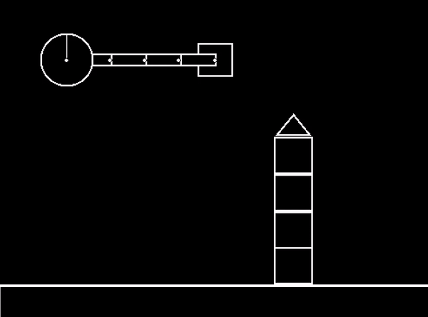

# Jax2D
Jax2D is a 2D rigid-body physics engine written entirely in [JAX](https://github.com/google/jax) and based off the [Box2D](https://github.com/erincatto/box2d) engine.
Unlike other JAX physics engines, Jax2D is dynamic with respect to scene configuration, allowing heterogeneous scenes to be parallelised with `vmap`.
Jax2D was initially created for the backend of the [Kinetix](https://github.com/FLAIROx/Kinetix) project and was developed by Michael_{[Matthews](https://github.com/MichaelTMatthews), [Beukman](https://github.com/Michael-Beukman)}.

<p align="center">
 
</p>

# Why should I use Jax2D?
The main reason to use Jax2D over other JAX physics engines such as [Brax](https://github.com/google/brax) or [MJX](https://github.com/google-deepmind/mujoco/tree/main/mjx) is that Jax2D scenes are (largely) dynamically specified.
Jax2D always has O(n^2) runtime with respect to the number of entities in a scene, since we must always calculate the full collision resolution for every pair of entities.
This means it is usually not appropriate for simulating scenes with large numbers (>100) of entities.

In short: Jax2D excels at simulating **lots** of **small** and **diverse** scenes in parallel **very fast**.

# Basic Usage
```python
# Create engine with default parameters
static_sim_params = StaticSimParams()
sim_params = SimParams()
engine = PhysicsEngine(static_sim_params)

# Create scene
sim_state = create_empty_sim(static_sim_params, floor_offset=0.0)

# Create a rectangle for the car body
sim_state, (_, r_index) = add_rectangle_to_scene(
    sim_state, static_sim_params, position=jnp.array([2.0, 1.0]), dimensions=jnp.array([1.0, 0.4])
)

# Create
sim_state, (_, c1_index) = add_circle_to_scene(sim_state, static_sim_params, position=jnp.array([1.5, 1.0]), radius=0.35)
sim_state, (_, c2_index) = add_circle_to_scene(sim_state, static_sim_params, position=jnp.array([2.5, 1.0]), radius=0.35)

sim_state, _ = add_revolute_joint_to_scene(
    sim_state, static_sim_params, a_index=r_index, b_index=c1_index, a_relative_pos=jnp.array([-0.5, 0.0]), b_relative_pos=jnp.zeros(2), motor_on=True
)
sim_state, _ = add_revolute_joint_to_scene(
    sim_state, static_sim_params, a_index=r_index, b_index=c2_index, a_relative_pos=jnp.array([0.5, 0.0]), b_relative_pos=jnp.zeros(2), motor_on=True
)

triangle_vertices = jnp.array(
    [
        [0.5, 0.1],
        [0.5, -0.1],
        [-0.5, -0.1],
    ]
)
sim_state, (_, t1) = add_polygon_to_scene(
    sim_state, static_sim_params, position=jnp.array([2.7, 0.1]), vertices=triangle_vertices, n_vertices=3, fixated=True
)

# Renderer
renderer = make_render_pixels(static_sim_params, screen_dim)

# Step scene
step_fn = jax.jit(engine.step)

pygame.init()
screen_surface = pygame.display.set_mode(screen_dim)

while True:
    actions = -jnp.ones(static_sim_params.num_joints + static_sim_params.num_thrusters)
    sim_state, _ = step_fn(sim_state, sim_params, actions)

    # Render
    pixels = renderer(sim_state)

    # Update screen
    surface = pygame.surfarray.make_surface(np.array(pixels)[:, ::-1])
    screen_surface.blit(surface, (0, 0))
    pygame.display.flip()

    for event in pygame.event.get():
        if event.type == pygame.QUIT:
            return True
```


# Installation
```commandline
git clone https://github.com/MichaelTMatthews/Jax2D.git
cd Jax2D
pip install -r requirements.txt -f https://storage.googleapis.com/jax-releases/jax_cuda_releases.html
pre-commit install
```

# 🔎 See Also
- 🍎 [Box2D](https://github.com/erincatto/box2d) The original C physics engine
- 🤖 [Kinetix](https://github.com/FLAIROx/Kinetix) Jax2D as a reinforcement learning environment
- 🌐 [KinetixJS](https://github.com/Michael-Beukman/KinetixJS) Jax2D reimplemented in Javascript
- 🦾 [Brax](https://github.com/google/brax) 3D physics in JAX
- 🦿 [MJX](https://github.com/google-deepmind/mujoco/tree/main/mjx) MuJoCo in JAX

# Citation
If you use Jax2D in your work please cite it as follows:
```
@software{matthews2024jax2d,
  author = {Michael Matthews, Michael Beukman},
  title = {Jax2D: A 2D physics engine in JAX},
  url = {http://github.com/MichaelTMatthews/Jax2D},
  year = {2024},
}
```

# Acknowledgements
We would like to thank [Erin Catto](https://github.com/erincatto) and [Randy Gaul](https://randygaul.github.io/) for their invaluable online materials that allowed the creation of this engine.  If you would like to develop your own physics engine, we recommend starting [here](https://randygaul.github.io/collision-detection/2019/06/19/Collision-Detection-in-2D-Some-Steps-for-Success.html).