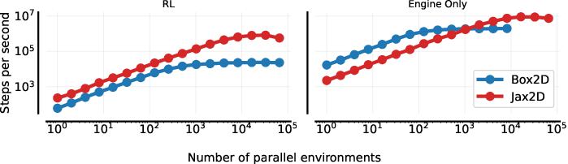
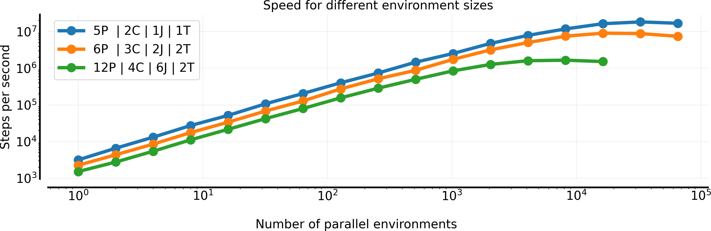

# Welcome to Jax2D!

Jax2D is a 2D rigid-body physics engine written entirely in [JAX](https://github.com/google/jax) and based off the [Box2D](https://github.com/erincatto/box2d) engine.
Unlike other JAX physics engines, Jax2D is dynamic with respect to scene configuration, allowing heterogeneous scenes to be parallelised with `vmap`.
Jax2D was initially created for the backend of the [Kinetix](https://github.com/FLAIROx/Kinetix) project and was developed by Michael_{[Matthews](https://github.com/MichaelTMatthews), [Beukman](https://github.com/Michael-Beukman)}.

See [here](./example) for example usage, and [here](#jax2d-the-sharp-bits) for important considerations when using Jax2D. If you are interested in how Jax2D works in detail, see Appendix A of our [Kinetix paper](https://arxiv.org/abs/2410.23208).

## Why Use Jax2D

The main reason to use Jax2D over other JAX physics engines such as [Brax](https://github.com/google/brax) or [MJX](https://github.com/google-deepmind/mujoco/tree/main/mjx) is that Jax2D scenes are (largely) dynamically specified.
Jax2D always has O(n^2) runtime with respect to the number of entities in a scene, since we must always calculate the full collision resolution for every pair of entities.
This means it is usually not appropriate for simulating scenes with large numbers (>100) of entities. Similarly, simulating only a single scene may not provide much benefit, and is in most cases slower than Box2D.

In short: Jax2D excels at simulating **lots** of **small** and **diverse** scenes in parallel **very fast**.

<p align="center">
    
    <br>
    As seen in this image, Jax2D can scale to hundreds of thousands of parallel environments, and is particularly effective when used in combination with a <a href="https://github.com/luchris429/purejaxrl/">PureJaxRL-style</a> reinforcement learning training pipeline
</p>

## Overview
How does Jax2D work? Each scene consists of only a few simple components, discussed below.
### RigidBody
First we have RigidBodies, which in our case means either polygons or circles. See [here](./entities#rigidbody) for more information about what properties RigidBodies possess.

### Joints
[Joints](./entities#joint) connect two distinct RigidBodies, and there are two types of joints, revolute and fixed. Fixed joints do not allow any change in relative rotation between shapes, and therefore can be used to create solid structures. Revolute joints, on the other hand, allow rotation, and can also be acted upon by a motor. This means we can create things like wheels, pendulums, etc.

### Thrusters
Finally, [thrusters](./entities#thruster) are connected to a single shape, and they allow force to be applied to this shape in one direction.

## 🔪 Jax2D: The Sharp Bits 🔪

Similarly to JAX, Jax2D has some aspects you should be cognisant of when using it, so as to not run into any major problems.

### Indices
!!! danger "Indices"
    Jax2D uses two primary ways to index shapes, due to how the `sim_state` is structured into two arrays, `circles` and `polygons`. These two ways are:

    - **Local Indices**: Here, the index is in the range `[0, len(array))`, and directly indexes the array.
    - **Global Indices**: This is the most commonly-used way to index objects, and the index falls in the range `[0, num_circles + num_polygons)`, representing an index into the concatenated array `polygons + circles`. In other words, for polygons, the global indices are the same as the array indices, whereas for a circle, we have `global_index = local_index + static_sim_params.num_polygons`. **This is the expected input for the `add_{thruster,revolute_joint,fixed_joint}_to_scene` functions.**

### Masking
Due to how Jax2D allows the simulation of many diverse scenes in parallel, each step effectively performs the same computation (namely, $n^2$ collisions) and masks out all of the inactive collisions. 

This means that at the end of most functions, we have something like

```python
return jax.tree.map(
    lambda updated, original: jax.lax.select(should_resolve, updated, original), 
    new_state, 
    old_state
)
```


### Collision Matrix
The collision matrix (`sim_state.collision_matrix`) controls which shapes collide with which other shapes. In particular, if two shapes are connected by a joint, then they do not collide. If two shapes are connected via a chain of other shapes, they are also not supposed to collide.
Whenever the functions in `scene.py` are used (e.g. `add_revolute_joint_to_scene`), we update the collision matrix accordingly.


!!! danger "Collision Matrix"
    However, be careful if you add joints manually, that you do run the following to ensure the collision matrix is correct.
    When you are unsure, it is better to run the following code too often, as it will never break anything.
    ```python
        sim_state = sim_state.replace(
            collision_matrix=calculate_collision_matrix(static_sim_params, 
                                                        sim_state.joint)
        )
    ```

### Fixated Objects

Each `RigidBody` has two parameters, `inverse_mass` and `inverse_inertia`. To simulate fixated objects that cannot be moved, we set their `inverse_mass` and `inverse_inertia` to `0`, simulating an infinite mass object. This means the shape will not be influenced by gravity, and will also not move at all when colliding with other objects.

Due to how we split `density` and `inverse_mass`, the `recalculate_mass_and_inertia` can properly recalculate the `inverse_mass` and `inverse_inertia` of shapes. It will not change any shape's mass if its `inverse_mass = 0`, but will accurately compute `inverse_mass` and `inverse_inertia` given the density of all other shapes.
```python
sim_state = recalculate_mass_and_inertia(sim_state, 
                                     static_sim_params, 
                                     polygon_densities, 
                                     circle_densities)
```

### Environment Size
Due to JAX requiring fixed array sizes at compile time, we specify the maximum number of each shape in `StaticSimParams` in `jax2d/sim_state.py`.

By default, we set these to 12 each. If you need more shapes, then you can change `StaticSimParams` accordingly. However, do note that Jax2D carries an $O(n^2)$ computational cost, where `n = num_polygons + num_circles`. So, if you are going to increase it, it will negatively impact simulation speed. Conversely, if you can get away with fewer shapes, reducing the number in `StaticSimParams` will be beneficial.
```python
class StaticSimParams:
    # State size
    num_polygons: int = 12
    num_circles: int = 12
    num_joints: int = 12
    num_thrusters: int = 12
```

In code, you can change these parameters as follows:

```python
static_sim_params = StaticSimParams() # create the default static params.
static_sim_params = static_sim_params.replace(
    num_polygons=...,
    num_circles=...,
    num_joints=...,
    num_thrusters=...,
)
```


<p align="center">
    
    <br>
    Here we show the speed for different environment sizes, and there is a clear performance cost when simulating larger scenes. 
    In the figure, `P` indicates how many polygons, `C` denotes circles, `J` is how many joints there are and `T` is how many thrusters there are.
</p>